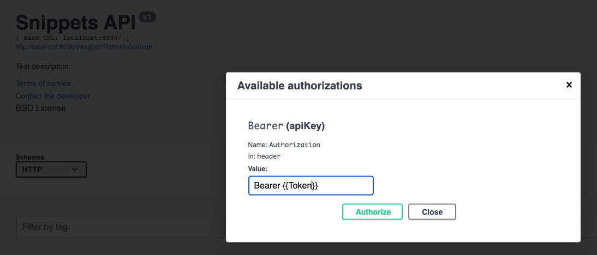

# Silabuz Challenge

this project is a basic clone of [Deezer API](https://developers.deezer.com/api)

## Before Project Run

copy .env.template paste in docker/ and rename it with .env with their variables
## Project Run

### Build 
```
make build
```

### Run 
```
make run
```

### Run Migrations and Migrate

open other terminal
```
make migrations
```

```
make migrate
```
### Open browser
```
http://localhost:8000
```

### Open browser with Swagger
```
http://localhost:8000/swagger
```

Login with jwt token



## Project Run Unit Test

### Run Test
```
make test
```
